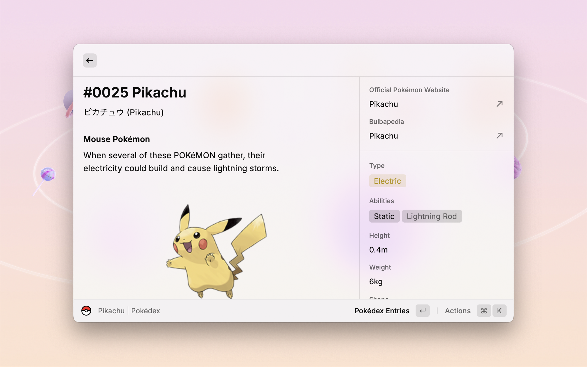

  <h1 align="center">Pokédex</h1>

Explore the world of Pokémon with stunning visuals and detailed information in Raycast.

## Features

### Commands

* **Pokédex:** Search and explore all 1025 Pokémon species with comprehensive data including stats, types, abilities, evolutions, learnsets, and encounter locations.
* **Type Chart:** View type matchups and interactions to understand strengths, weaknesses, and resistances.
* **Natures:** Browse Pokémon natures and their effects on stat growth.
* **Moves:** Access detailed move information including base power, accuracy, PP, type, category, priority, and more.
* **Abilities:** Look up ability descriptions and effects.
* **Weaknesses:** Analyze type effectiveness for any Pokémon or type combination.

### Customization

* **Language Support:** English, French, German, Italian, Japanese, Korean, Spanish, Simplified & Traditional Chinese.
* **Type Filtering:** Narrow results by Pokémon type in the Pokédex.
* **Sorting Options:** Sort by Pokémon name or National Pokédex number.
* **Artwork Styles:** Choose between official artwork or pixel art sprites.
* **Quick Links:** Direct access to official Pokémon website and Bulbapedia.

## TODO

* Integrate Pokémon sprites into Pokédex search results.
* Items command with item effects and locations.

## Issues

Report bugs or suggest improvements by creating an issue [here](https://github.com/anhthang/raycast-pokedex/issues).

## Credits

**Pokémon:**

* Data: [PokéAPI](https://pokeapi.co/)
* Official Artwork & Sprites (Up to National Dex #649): © Nintendo/The Pokémon Company/GAME FREAK Inc.
* Pixel Art Sprites (National Dex #650 and above): [Smogon community](https://www.smogon.com/forums/threads/smogon-sprite-project.3647722/) (special thanks for their contributions), [Smogon Sprite Project Spreadsheet](https://docs.google.com/spreadsheets/d/1acgzAjh0dnFRQnjZu8kSjS177rKCzpFfEHRLtwuuXRU/edit?gid=0#gid=0)
* Generation 9 Sprites: [KingOfThe-X-Roads](https://www.deviantart.com/kingofthe-x-roads)

**Icons:**

* Pokémon Types and Sorting: [Zukan](https://zukan.pokemon.co.jp/)
* Pokémon Move Damage Class: [Smogon](https://www.smogon.com/dex/ss/moves/)
* Bulbapedia: [Bulbagarden](https://bulbagarden.net/)
