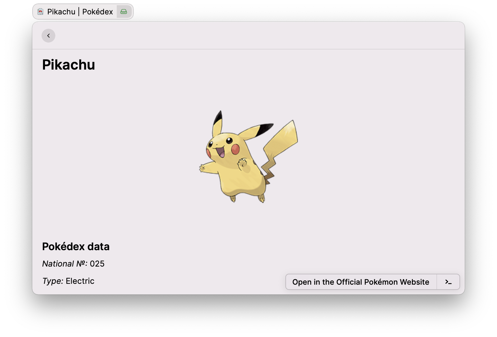

  
  <h1 align="center">Pokédex</h1>

A [Raycast](https://raycast.com/) extenstion that lets you search for a Pokémon by name or using its National Pokédex number.

This extension is made by [Anh Thang Bui](https://github.com/anhthang) and uses [PokéAPI](https://pokeapi.co/).

## Features

- [x] 🔍 Search for a Pokémon by name or using its National Pokédex number.
- [x] Surprise Me!
- [x] Pokémon details by prefered language. Supported: English (default), French, German, Italian, Japanese, Korean, Spanish.

## TODO

- [ ] Egg moves
- [ ] Moves learnt by level up
- [ ] Moves learnt by TM
- [ ] Name in other languages
- [ ] Sprites
- [ ] Where to find

## Issue tracker

https://github.com/anhthang/raycast-pokedex/issues

## Notes

Icon downloaded from [Iconfinder](https://www.iconfinder.com/icons/1337536/game_go_play_pokedex_pokemon_tool_icon)
