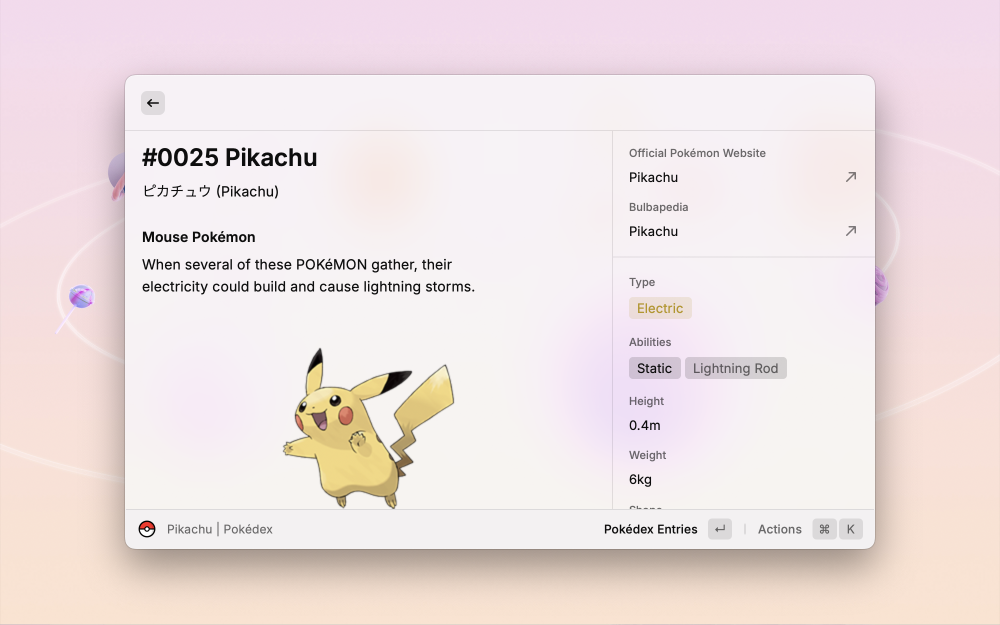

  <h1 align="center">Pokédex</h1>

Explore the world of Pokémon with stunning visuals and detailed information in Raycast.

## Features

### Commands

* **Pokédex:** Search and explore all 1025 Pokémon species with comprehensive data including stats, types, abilities, evolutions, learnsets, and encounter locations.
* **Type Chart:** View type matchups and interactions to understand strengths, weaknesses, and resistances.
* **Natures:** Browse Pokémon natures and their effects on stat growth.
* **Moves:** Access detailed move information including base power, accuracy, PP, type, category, priority, and more.
* **Abilities:** Look up ability descriptions and effects.
* **Items:** Browse and filter Pokémon items by pocket, view item effects, and item prices.
* **Weaknesses:** Analyze type effectiveness for any Pokémon or type combination.

### Customization

* **Language Support:** English, French, German, Italian, Japanese, Korean, Spanish, Simplified Chinese & Traditional Chinese.
* **Type Filtering:** Narrow results by Pokémon type in the Pokédex.
* **Sorting Options:** Sort by Pokémon name or National Pokédex number.
* **Artwork Styles:** Choose between official artwork, Black & White–style sprites, or Scarlet & Violet–style sprites.
* **Shiny Display Option:** Toggle to display Pokémon as shiny sprites (available for official artwork and Black & White sprites; not supported for Scarlet & Violet sprites).
* **Quick Links:** Direct access to the official Pokémon website and Bulbapedia.

## TODO

* Integrate Pokémon sprites into Pokédex search results.

## Issues

Report bugs or suggest improvements by creating an issue [here](https://github.com/anhthang/raycast-pokedex/issues).

## Credits

### Official Pokémon Assets

All official artwork and sprites — including Black & White–style sprites (up to National Dex #649) and Scarlet & Violet–style sprites — © Nintendo / The Pokémon Company / GAME FREAK Inc.

### Community & Data Resources

* Pokémon data provided by [PokéAPI](https://pokeapi.co/)
* Black & White–style sprites for National Dex #650+ provided by the [Smogon Sprite Project](https://www.smogon.com/forums/threads/smogon-sprite-project.3647722/) huge thanks to their contributors for making these available.
  * [Generation 6 Spreadsheet](https://docs.google.com/spreadsheets/d/1Gn0UORn-unvcbUeQhQdEBz0ADNcH49BZZqQ1dpXm9eo)
  * [Generation 7 Spreadsheet](https://docs.google.com/spreadsheets/d/1FMcHbSKEWZc7v2Ur4cyJjT_NhO0gqXyU9kDhsOQhlBQ)
  * [Generation 8 Spreadsheet](https://docs.google.com/spreadsheets/d/1acgzAjh0dnFRQnjZu8kSjS177rKCzpFfEHRLtwuuXRU)
  * [Generation 9 Spreadsheet](https://docs.google.com/spreadsheets/d/1MCjDktTOOFjLKM5C-RW6SfBQGkjlxDSCZAZDma_ItuA)
  * Additional Generation 9 Sprites by [KingOfThe-X-Roads on DeviantArt](https://www.deviantart.com/kingofthe-x-roads)
* Scarlet & Violet–style sprites obtained via [Project Pokémon](https://projectpokemon.org/home/docs/spriteindex_148/switch-sv-style-sprites-for-home-r153/)

### Icons

* Pokémon Types and Sorting: [Zukan](https://zukan.pokemon.co.jp/)
* Pokémon Move Damage Class: [Smogon](https://www.smogon.com/dex/ss/moves/)
* Bulbapedia: [Bulbagarden](https://bulbagarden.net/)
